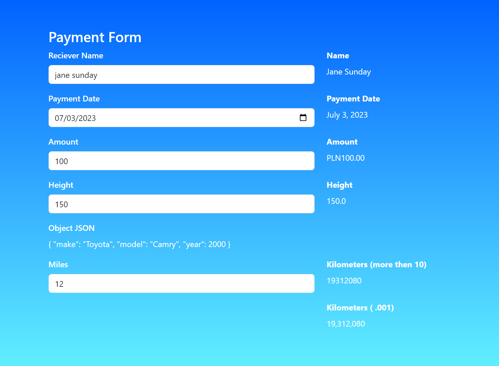

<h1 align="center">Pipes</h1>

   Project created for practice and improving knowledge of Angular and TypeScript.

  <h3>
    <a href="#">
      Demo
    </a>
  </h3>

## Table of Contents

- [Overview](#overview)
  - [Built With](#built-with)
- [Features](#features)
- [Acknowledgements](#acknowledgements)
- [Contact](#contact)

## Overview

With this project I've learned/improved:

- Using Common Pipes
- Creating Custom Pipes
- Custom Arguments

### Built With

- This project was generated with [Angular CLI](https://github.com/angular/angular-cli) version 16.1.1.
- Deploy with [Vercel CLI](https://vercel.com) version 30.2.3.
- [Bootstrap](https://www.npmjs.com/package/bootstrap)

## Features

- Transforms text to title case.
- Formats a date value.
- Transforms a number to a currency string, formatted currency code, such as PLN.
- Sets digit representation.
- Converts a value into its JSON-format representation.
- Convert miles to: km || m || cm.

## Acknowledgements

- [The Modern Angular Bootcamp](https://www.udemy.com/share/102vm43@kPKjsEC86Z2cm1N7cEMAmpq9YQoyx7o7SNnGaYvWULiDXHnFRZr64mMgoyrYOv78/)

## Contact

- Website [cv-webpage](https://ievgeniiaabdulina.github.io/rsschool-cv/)
- Portfolio [Personal-Portfolio-Webpage](https://ievgeniiaabdulina.github.io/Personal-Portfolio-Webpage/)
- GitHub [@IevgeniiaAbdulina](https://github.com/IevgeniiaAbdulina)

 
Date: 7/2023
